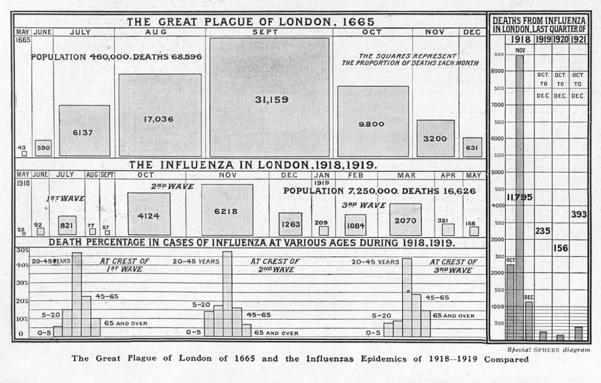

# Einführung in die Fallstudie
## 1. Heranführung an die Fragestellung
Dass Pandemien ihre je eigenen Verlaufsprofile entwickeln, konnte Zeitgenoss:innen vor wenigen Jahren am Verlauf der COVID19-Pandemie miterleben. Schnell wurde die Rede von den "Wellen" der Corona-Pandemie sprichwörtlich. 

*Vergleichende Grafik zum Verlauf der Pest (1665) und der Spanischen Grippe (1918/19) in London. Quelle: @staveley-wadham_british_2021*

Aus Perspektive einer medienwissenschaftlich informierten historischen Epidemiologie überlagern sich dabei unterschiedliche Wellen: Während ‘Fallzahlen‘ (z.B. die Anzahl der Infektionen oder die Anzahl der Todesfälle) ein in erster Linie medizinisch zu erhebendes Maß sind, sind die unterschiedliche Intensität und Extensität der öffentlichen Wahrnehmung des pandemischen Geschehens ein Untersuchungsgegenstand der (historischen) Medienwissenschaft. 

## 2. Forschungsfrage 

## 3. Operationalisierung der Forschungsfrage

## 4. 

  * research question
  * digital analysis is corpus analysis: text as corpus data
  * corpus of newspapers
  * what you will learn here
